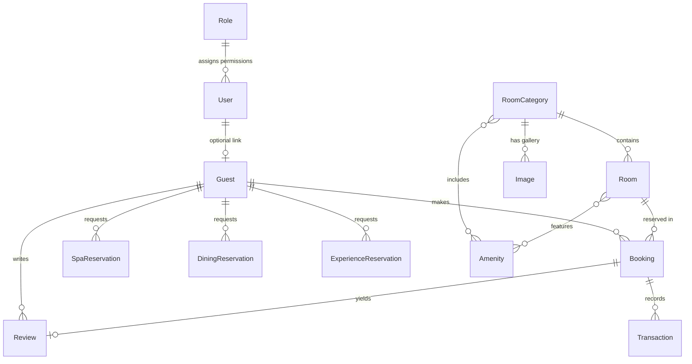

# Hotel Luxury Website — Demo Documentation

## 1. Product Overview

This project is a full-stack, enterprise-grade luxury hotel website and content-management ecosystem. It combines:

- **Public-Facing Discovery & Booking Experience**: An immersive, responsive guest portal featuring category and room discovery, advanced date/occupancy filtering, multi-service reservations (rooms, spa, dining, and bespoke experiences), Google OAuth guest sign-in, and flexible payment workflows (credit card via Stripe and direct QR transfer).
- **Executive Operations & Reception Panel**: Dedicated operational workspaces for front-desk receptionists and hotel managers (`/admin/reception`, `/admin/dashboard`, `/admin/bookings`, `/admin/reservations`, `/admin/messages`, `/admin/guests`).
- **Comprehensive Hotel Inventory & Commerce CMS**: Full lifecycle CRUD for rooms, room categories, amenities, promotions/coupons, and guest review moderation.
- **Dynamic Content & Experience Management (No-Code CMS)**: Visual page builders for the Homepage, Rooms & Suites (both main catalog and individual category landing pages), Dining (with dedicated venue, chef's menu, and gallery managers), Spa & Wellness, Bespoke Experiences, Photo Gallery, FAQs, Contact, and User Dashboard.
- **Global Design System & White-Label Configuration**: Database-backed typography engine (separate font selections and sizes for frontend headings, admin panel headings, logo typography, and body text), startup loader screen customization, navbar builder, footer link builder, and payment gateway configuration.
- **Relational PostgreSQL Database via Prisma ORM**: Strongly typed schemas, cascade relationships, and automated timestamp tracking.
- **Role-Based Access Control (RBAC) & Security**: Multi-provider authentication (Credentials with bcrypt and Google OAuth via NextAuth/Auth.js), route-level middleware protection with granular permission matching, API session authorization guards, and in-memory rate limiting.

The primary demo storyline demonstrates a complete hospitality lifecycle: a prospective guest discovers the property, filters available inventory, books a suite with an upfront reservation fee, requests signature spa and dining services, and manages itineraries from their guest portal. Simultaneously, front-desk receptionists and administrators monitor arrivals, confirm payments, check guests in/out, resolve cancellation requests, moderate reviews, and customize every visual element and typography token across the platform in real time without writing code.

---

## 2. Public Website Architecture & Guest Journey

The public website is database-driven and fluidly responsive across mobile, tablet, laptop, and ultra-wide desktop viewports. Every section adapts dynamically to stored CMS settings.

### 2.1 Global Navigation Header (`Navbar`)

- **Sticky Blur Header**: Transparent on page hero; automatically transitions into a frosted glass background (`backdrop-blur-md bg-background/95`) with shadow upon scrolling (>50px) or on static legal pages (`/terms`, `/privacy`).
- **Dynamic Brand Logo**: Clickable logo linking to `/` styled with the administrator-configured logo typography.
- **Dynamic Navigation Links**: Rendered dynamically from database settings (`getNavbarSettings`). Supports multi-level hierarchical dropdown menus with smooth enter/exit animations (`framer-motion`).
- **Global Call-to-Action (CTA) Button**: Configurable label, destination URL, and visibility toggle (e.g., "Reserve Your Experience").
- **Guest Authentication State**:
  - Unauthenticated: Displays a clean user icon and "Login" trigger that launches Google OAuth in a popup window (`/login/popup-complete`).
  - Authenticated: Replaces login controls with a direct profile shortcut to the guest account dashboard (`/account`), hiding extraneous authentication buttons.
- **Mobile Navigation Drawer**: Responsive slide-out sheet menu with expandable dropdown accordions and full touch-optimized navigation.

### 2.2 Startup Screen Loader

- **Configurable Splash Screen**: Renders upon initial page visits with exit animations (`framer-motion`).
- **Dynamic Brand Asset**: Displays an administrator-uploaded custom image or logo (with inverted monochrome styling) or falls back to an animated, typography-matched text display (`HOTEL LUXURY`).
- **Visibility Control**: Can be toggled on or off from the System Settings panel.

### 2.3 Homepage — `/`

The homepage is dynamically composed of modular, reorderable sections governed by `HomepageSettings`:

- **Hero Banner**: Full-bleed background video or high-resolution fallback image, customizable main headline, supporting subtitle, typography size controls, and primary reservation call-to-action button.
- **Search Hero**: Dedicated video-backed search initiation section linking to advanced discovery.
- **Featured Accommodations**: Curated showcase of top suites with room descriptions, nightly rates, key amenity badges, and high-resolution photography.
- **Amenities & Highlights**: Property highlights featuring luxury icons (high-speed Wi-Fi, artisanal coffee, fine dining, state-of-the-art gym) with descriptive blurbs.
- **Our Story / Legacy**: Narrative section celebrating the hotel's heritage, architecture, and hospitality philosophy with imagery and dedicated reading link.
- **Culinary Excellence Section**: Dining teaser highlighting master chefs, ambient restaurant photography, and direct link to `/dining`.
- **Spa & Wellness Sanctuary**: Wellness teaser with imagery, treatment overview, and direct link to `/spa`.
- **Bespoke Experiences**: Teaser for curated local adventures, yacht charters, and private tastings linking to `/experiences`.
- **Guest Testimonials**: Social proof carousel/grid displaying verified guest quotes, author roles, and 5-star rating scores.
- **Bottom Booking Call-to-Action**: Full-width conversion banner prompting immediate reservations.

### 2.4 Rooms & Suites Catalog — `/rooms-and-suites`

- **Catalog Hero**: Video-supported header introducing the hotel's collection of accommodations.
- **Category Listing Grid**: Displays all database-backed room categories (`RoomCategory`) with base pricing, occupancy capacity, bed types, square footage, and photo galleries.
- **Category Details Navigation**: Each category card links directly to its dedicated category page at `/rooms-and-suites/[slug]`.

### 2.5 Category Showcase — `/rooms-and-suites/[slug]`

- **Dedicated Category Hero**: Displays category-specific imagery/video managed in the CMS.
- **Category Specifications**: Highlights suite dimensions, maximum occupancy, bed configuration, and comprehensive amenity listings.
- **Individual Room Inventory Listing**: Displays all distinct physical rooms belonging to this category with individual room numbers, availability status, unique rates, and direct links to room detail pages.
- **Complimentary Inclusions**: Package highlights (valet parking, daily breakfast buffet, personalized climate control, high-speed Wi-Fi).

### 2.6 Individual Room Detail & In-Page Booking — `/rooms-and-suites/[slug]/[roomNumber]`

- **Room Media Showcase**: Custom video header and multi-image photo gallery carousel (`RoomGallery`).
- **Room Specifications**: Exact room number, pricing per night, dimensions, occupancy limits, and detailed architectural description.
- **Interactive In-Page Booking Widget (`BookingForm`)**:
  - **Step 1 (Guest Information & Dates)**: Captures full name, email address, phone number, check-in date, and check-out date. Date pickers enforce forward-looking dates and require check-out to follow check-in. Automatically calculates the total duration (nights) and live stay estimate (`nights * room price`).
  - **Step 2 (Secure Payment & Upfront Deposit)**: If payment options are enabled in System Settings, calculates the required upfront reservation fee (e.g., 20% of total stay). Allows guest to toggle between **Credit Card (Stripe)** and **QR Transfer**. For QR payments, displays the admin-uploaded QR code image and validates the transfer Reference ID. For Credit Card payments, renders secure Stripe Elements.
  - **Step 3 (Confirmation State)**: Success screen showing booking confirmation reference code, notification that itinerary details were sent, direct email shortcut, and option to reserve another room.
- **Package Inclusions Grid**: Visual cards highlighting complimentary amenities tailored to the room's category.
- **Explore More Accommodations**: Recommendation grid featuring other room categories to encourage further discovery.

### 2.7 Advanced Search & Filtering — `/search`

- **Video Banner**: Ambient video backdrop with dynamic page titles that reflect active search parameters.
- **Advanced Search Sidebar (`AdvancedSearchSidebar`)**:
  - Check-in and check-out date pickers with automatic next-day departure adjustment.
  - Guest party size selector (1, 2, 3, 4, 5+ Guests).
  - Nightly price range inputs (Minimum $ and Maximum $).
  - Multi-select Room Category filter checkboxes loaded dynamically from database categories.
  - Mobile-friendly filter drawer with collapsible toggle.
  - "Update Search" and "Reset Filters" controls.
- **Real-Time Availability Engine**: Server action (`searchAvailableRooms`) performs date collision detection against existing bookings in the database:
  $$\text{Overlap Condition: } (\text{checkIn} < \text{departure}) \land (\text{checkOut} > \text{arrival}) \land (\text{status} \neq \text{CANCELLED})$$
  Excludes occupied or overlapping rooms and filters by occupancy and price thresholds.
- **Paginated Results Grid (`SearchResults`)**: Responsive room cards with room number, category badge, description, nightly rate, and direct reservation triggers. Includes "View More" button for incremental batch loading (`take: 12, skip: N`).
- **Smart Recommendations Fallback**: When no rooms match the exact dates or criteria, the UI automatically displays luxury recommendations ("Highly Recommended Alternatives") to prevent dead ends.

### 2.8 Dedicated Checkout Flow — `/booking`

- Dedicated full-page checkout alternative accessible via search results: `/booking?roomId=...&arrival=...&departure=...&guests=...`.
- **Reservation Summary Card**: Sticky desktop summary card displaying room thumbnail, room number, category name, guest count, check-in date/time, check-out date/time, night multiplier, and total due.
- **Guest Checkout Form (`BookingForm`)**: Two-column responsive checkout form validating guest credentials and processing Credit Card or QR payment methods.

### 2.9 Dining & Gastronomy — `/dining`

- **Hero & Intro**: Ambient video/image header with narrative culinary introduction.
- **Distinctive Venues Listing (`RestaurantsList`)**: Interactive showcase of hotel dining venues (fine dining, bistro, rooftop lounge). Each venue card features opening hours, cuisine type, dress code, and an interactive **"Reserve Table"** trigger.
- **Dining Reservation Modal (`ServiceReservationForm`)**:
  - Allows guests to select a venue from database-loaded options.
  - Select preferred date and time (`datetime-local`).
  - Specify party size (1–20 guests) and special dietary or seating requests.
  - Supports one-click Google OAuth sign-in if guest is not yet authenticated.
  - Directly creates a `DiningReservation` record with `PENDING` status.
- **Chef's Special Menus (`DiningMenuSection`)**: Structured menu categories (Starters, Mains, Desserts, Cocktails) with dish names, pricing, and descriptions.
- **Ambient Lifestyle Sliders**: Dedicated content sections for Bar & Lounge (`DiningSliderSection`), Culinary Events (`DiningFeatureSection`), Live Music Nights (`DiningGridSection`), and Private Dining Experiences (`DiningFeatureSection`).

### 2.10 Spa & Holistic Wellness — `/spa`

- **Hero & Philosophy**: Tranquil video/image banner and holistic philosophy copy.
- **Signature Treatments (`SpaTreatmentsList`)**: Database-backed treatment categories and services (massages, facials, hydrotherapy, body scrubs) with durations and pricing.
- **Spa Reservation Modal (`ServiceReservationForm`)**:
  - Pre-fills the selected signature treatment.
  - Select preferred treatment date and time.
  - Specify number of guests and personal wellness notes.
  - Integrates guest authentication check with Google login popup.
  - Creates a `SpaReservation` record with `PENDING` status.
- **World-Class Facilities (`SpaFacilitiesSection`)**: Multi-card showcase of wellness amenities (thermal pools, saunas, relaxation lounges, steam rooms) with multi-image galleries.

### 2.11 Bespoke Experiences — `/experiences`

- **Hero & Narrative**: Introduction to personalized guest adventures and excursions.
- **Featured Experiences Carousel (`ExperiencesFeatured`)**: Horizontal scrollable snap-carousel of signature excursions (private yacht charters, mountain helicopter tours, vineyard wine tastings, historic cultural walks) with duration indicators and descriptive storytelling.
- **Experience Reservation Modal (`ServiceReservationForm`)**:
  - Pre-fills the selected adventure.
  - Captures preferred scheduling, group size, and custom requirements.
  - Creates an `ExperienceReservation` record with `PENDING` status.
- **Local Destination Guide (`ExperiencesLocalGuide`)**: Insider concierge recommendations for local art galleries, historic landmarks, shopping districts, and scenic lookouts.

### 2.12 Visual Gallery — `/gallery`

- **Hero Banner**: Gallery introduction and title.
- **Masonry Grid Layout**: Dynamic, responsive photo gallery showcasing architectural details, interior design, culinary creations, spa facilities, and grounds.
- **Full Database Control**: Every gallery image is uploaded, captioned, categorized, and managed through the admin panel.

### 2.13 Frequently Asked Questions — `/faq`

- **Accordion Interface**: Expandable question-and-answer accordions for seamless browsing.
- **Dynamic Content**: Questions, detailed answers, ordering, and section visibility managed entirely via the FAQ admin editor.

### 2.14 Contact Us — `/contact`

- **Interactive Contact Information**: Display cards for physical property address, telephone numbers with operating hours, and dedicated concierge email.
- **Live Google Map Integration**: Embedded map dynamically positioned according to the address configured in CMS settings.
- **Secure Public Contact Form (`ContactForm`)**:
  - Captures guest name, email address, optional phone number, subject, and message.
  - **In-Memory Rate Limiting**: Enforces a strict rate limit of 3 submissions per IP address per 60-second window to prevent spam abuse.
  - **Input Validation**: Server-side Zod validation ensuring valid email formatting, phone digit structures, and minimum message length.
  - **Persistence**: Persists directly into `ContactMessage` with `isRead: false`, immediately incrementing the admin unread badge.

### 2.15 Legal Pages — `/terms` and `/privacy`

- Standard legal documentation pages styled with the global typography system and consistent header/footer layout.

### 2.16 Guest Authentication & Portal — `/login` & `/account`

- **Dedicated Guest Login Screen (`/login`)**:
  - Ambient hero background image driven by CMS settings.
  - Clean card layout with Google OAuth authentication.
  - Logged-in guests are automatically redirected to `/account`.
- **Google OAuth Popup Workflow (`/login/popup-complete`)**:
  - Guests initiating login from the navbar or service reservation modals experience a seamless popup window.
  - Upon successful Google authentication, the popup notifies the parent window via `postMessage`, updates navigation state instantly, and closes itself without full page reload.
  - Public sign-in automatically provisions a `Guest` record and links a `User` account with the `USER` role.
  - Public users are strictly sandboxed: attempts to access `/admin/*` automatically redirect them to `/account`.
- **Guest Account Dashboard (`/account`)**:
  - **Hero Section**: Personalized greeting ("Welcome, [Guest Name]"), customizable subtitle, and logout control.
  - **Room Bookings Section**: Detailed cards for past and upcoming stays, showing room number, room category, stay dates, and live status badges (`PENDING_PAYMENT`, `CONFIRMED`, `CHECKED_IN`, `CHECKED_OUT`, `CANCELLED`).
  - **In-App Cancellation Action**: For active bookings, displays a **"Request cancellation"** trigger (`CancelRequestButton`).
  - **Hotel Services Quick Access**: Direct shortcuts to request spa appointments or reserve dining tables.
  - **Activity & Service History**: Track statuses of pending and confirmed Spa and Dining requests. Each active service request features a "Request cancellation" button.
  - **Cancellation Messaging Bridge**: Submitting a cancellation request creates a high-priority `ContactMessage` flagged with metadata `[Cancellation Request]`, alerting the front-desk team immediately.

### 2.17 Global Footer (`Footer`)

- **Brand Information**: Dynamic brand description and registered copyright notice.
- **Direct Contact Details**: Address, phone, and reservations email.
- **Social Media Icons**: Configurable links to Instagram, Facebook, Twitter, and other platforms.
- **Explore & Quick Links**: Database-driven link lists rendering dynamic navigation destinations managed via the admin panel.

---

## 3. Executive Operations & Reception Panel

The administrative panel provides a comprehensive management workspace designed for hotel owners, general managers, and front-desk receptionists.

### 3.1 Security & Authentication — `/admin/login`

- **Executive Login Portal**: Clean interface with building badge, email/password fields, and loading states.
- **NextAuth Credentials Integration**: Verifies credentials against the `User` table using bcrypt password hashing.
- **Session-Aware Redirection**: Authenticated staff are routed to `/admin/dashboard`; guests with `USER` role attempting to access admin login are redirected to `/account`.

### 3.2 Global Admin Shell, Topbar & Navigation

- **Responsive Admin Sidebar**:
  - Collapsible sidebar toggle (collapses from 256px to 80px width) preserving screen real estate.
  - Segmented navigation groups: **Operations**, **Pages**, and **System**.
  - **Real-Time Notification Badges**: Live counters for unread bookings, unread contact messages, and pending service reservations polled every 30 seconds.
  - **Role-Based Tab Visibility**: Menu items are dynamically filtered to display only the sections granted to the authenticated user's role.
- **Admin Topbar (`Topbar`)**:
  - Mobile hamburger trigger opening a responsive slide-out navigation sheet.
  - User identity display with name, role label, and user avatar.
  - **Interactive Notification Bell**: Displays total aggregate unread notifications (bookings + messages + reservations) with a dropdown menu linking directly to Bookings, Reservations, or Messages.
- **Global Command Palette (`AdminSearch` / `⌘K`)**:
  - Keyboard shortcut (`⌘K` on Mac, `Ctrl+K` on Windows) opening a command dialog.
  - Quick-search fuzzy navigation across all 11 Operations tabs, 10 CMS Page editors, and 5 System settings pages.

---

## 4. Admin Workspaces — Operations

### 4.1 Reception Dashboard — `/admin/reception`

A front-office workspace built specifically for receptionists and front-desk managers:

- **KPI Metrics Bar**: Upcoming arrivals/bookings count, total registered guest profiles count, and pending payment follow-up count (`PENDING_PAYMENT`).
- **Front Desk Queue (`ReceptionQueue`)**: Chronological arrival list displaying guest name, room number, check-in date, check-out date, total stay amount, and current status.
- **Instant Lifecycle Action Controls**:
  - `PENDING_PAYMENT` bookings: **"Confirm payment"** button (transitions booking to `CONFIRMED`).
  - `CONFIRMED` bookings: **"Check in"** button (transitions booking to `CHECKED_IN`).
  - `CHECKED_IN` bookings: **"Check out"** button (transitions booking to `CHECKED_OUT`).
  - Non-finalized bookings: **"Cancel"** button with destructive styling.

### 4.2 Executive Management Dashboard — `/admin/dashboard`

The high-level analytical hub for hotel management:

- **Summary Metrics**: Available rooms count, occupied rooms count, pending reviews count, total guests count, and unread contact messages.
- **Room Allocation Donut Chart**: Visual distribution of available, occupied, and maintenance/cleaning rooms.
- **7-Day Revenue vs. Expense Chart**: Multi-line visualization powered by Recharts plotting seven-day income and expenses from `Transaction` data.
- **Recent Bookings Table**: Real-time snapshot of the latest room reservations.
- **Today's Check-ins**: Focused list of guests scheduled to arrive today.

### 4.3 Bookings Management — `/admin/bookings`

Full-featured reservation management interface:

- **Comprehensive Data Grid**: Displays guest name, email, room number, room category, check-in and check-out dates, total stay amount, payment method (Card/QR), reservation fee paid, payment reference ID, and color-coded status badges (`PENDING`, `CONFIRMED`, `CHECKED_IN`, `CHECKED_OUT`, `CANCELLED`).
- **Responsive Card Transformation**: On mobile and tablet screens, tables convert into stacked cards with clear field labels and touch affordances.
- **Booking Details Dialog**:
  - View full guest contact information (name, email, phone).
  - Review stay dates and room assignment.
  - Inspect payment audit details (method, fee amount paid, transaction reference string).
  - One-click status actions: **"Confirm Booking"**, **"Cancel Booking"**, or **"Delete entirely"** (with cascade protection).
- **Export Schedule Action**: Dedicated trigger for exporting booking schedules.

### 4.4 Multi-Service Reservations Hub — `/admin/reservations`

Unified management workspace for non-room hospitality services:

- **Consolidated Feed**: Aggregates `SpaReservation`, `DiningReservation`, and `ExperienceReservation` entries sorted by creation date.
- **Type Badges**: Distinct visual badges for **Spa**, **Dining**, and **Experience**.
- **Request Details**: Displays requested service/restaurant/experience title, scheduled date and time, party size, guest name, guest email, and optional guest notes.
- **Status Lifecycle Workflow**:
  - `PENDING` requests: **"Confirm"** action.
  - Active requests: **"Cancel"** action.
  - `CONFIRMED` requests: **"Complete"** action.
- **Badge Counter**: Outstanding pending requests are reflected in the admin sidebar counter and notification bell.

### 4.5 Messages & Cancellation Resolution — `/admin/messages`

Communication center for guest inquiries and cancellation requests:

- **Inbox Grid**: Unread blue dot indicators, sender name, email, subject line, formatted timestamp, and delete action.
- **Message Inspection Dialog**: Displays full inquiry text, sender details, and direct communication links (`mailto:` and `tel:`).
- **Embedded Cancellation Request Workflow**:
  - When a message contains a cancellation request submitted from `/account`, the dialog highlights an amber alert banner: _"Guest cancellation request"_.
  - **"Confirm cancellation"** Button: Automatically parses the embedded request metadata, calls `resolveCancellationMessage`, updates the corresponding `Booking`, `SpaReservation`, `DiningReservation`, or `ExperienceReservation` record status to `CANCELLED`, marks the message as read, and prepends `[Cancellation Approved]` to the subject line.
  - **"Decline"** Button: Marks the message as read and updates the subject line to `[Cancellation Declined]`.

### 4.6 Rooms Inventory Management — `/admin/rooms`

Complete physical inventory configuration:

- **Inventory Metrics**: Total rooms, available rooms, occupied rooms, and rooms under maintenance/cleaning.
- **Rooms Directory Grid**: Displays room number, category name, room image thumbnail, cleaning/occupancy status, and nightly rate.
- **Room CRUD Dialog**:
  - Optional custom room name (e.g., "Ocean View Suite 101").
  - Room number identifier.
  - Category assignment dropdown.
  - Status selector: `AVAILABLE`, `OCCUPIED`, `MAINTENANCE`, `CLEANING`.
  - Nightly price override.
  - Room description text area.
  - Image upload with instant preview.
  - Video upload with video player preview.
  - **Custom Room Amenities Checklist**: Select amenities specific to this room; automatically pre-populates category defaults upon selection.

### 4.7 Categories Management — `/admin/categories`

Room tier and suite classification management:

- **Category Grid**: Displays category name, base nightly rate, total assigned room units count, and gallery thumbnail.
- **Category CRUD Dialog**:
  - Category name and auto-generated URL slug.
  - Base nightly price.
  - Detailed description.
  - Dimensions (e.g., "45 m²"), Bed Type (e.g., "1 King Bed"), and Occupancy Capacity (e.g., 2 Guests).
  - Reusable amenities multi-select checkboxes.
  - Multi-image gallery uploader with individual image deletion.

### 4.8 Amenities Management — `/admin/amenities`

Reusable property and room feature directory:

- **Amenities List**: Amenity name, assigned Lucide icon identifier, and total items metric.
- **Amenity CRUD Dialog**:
  - Amenity name input.
  - Icon selector featuring 17 curated Lucide icon representations (Wi-Fi, TV, Coffee, AC/Wind, Bath, Parking, Dining, Gym, Smoking, Wine/Bar, Key, Workspace, Air Conditioning, Phone, Business Center, Garden View, Sparkles).

### 4.9 Promotions & Coupons — `/admin/promotions`

Commercial discount code and campaign engine:

- **Promotions Grid**: Coupon code, discount value, usage limits, expiration state, and live status badge (`Active`, `Expired`, `Limit Reached`).
- **Promotion CRUD Dialog**:
  - Coupon code input (automatically converted to uppercase).
  - Discount type toggle: **Percentage (%)** or **Flat Amount ($)**.
  - Discount numeric value.
  - Optional maximum usage limit (leave blank for unlimited).
  - Optional expiration validity date (`validUntil`).
- **Usage Tracking**: Automatically increments `usageCount` as codes are redeemed.

### 4.10 Reviews Moderation — `/admin/reviews`

Public testimonial moderation queue:

- **Moderation Summary**: Live counts for pending reviews vs. approved public reviews.
- **Review List**: Guest name, associated room number and category, 5-star visual rating, written review comment, and moderation badge (`Pending` vs. `Public`).
- **Moderation Actions**:
  - **Approve**: Marks `isApproved: true`, immediately making the review visible on the public frontend.
  - **Reject & Delete**: Permanently purges inappropriate reviews with confirmation prompt.
  - **Mobile Touch Dialog**: Optimized touch workflow for mobile review management.

### 4.11 Guests CRM Directory — `/admin/guests`

Customer relationship management and guest profiling:

- **CRM Overview**: Total registered guests count and new-this-month acquisition metrics.
- **Guest Table**: Guest full name, email address, phone number, total booking count, and action menu.
- **Comprehensive Guest Profile Dialog**:
  - **Automated Guest Categorization**: Dynamically evaluates the guest's entire reservation history to determine their guest persona: _"Room guest"_, _"Spa guest"_, _"Dining guest"_, or multi-service combinations (e.g., _"Room guest · Spa guest · Dining guest"_).
  - **Activity Breakdown Cards**: Live counts for Room Bookings, Spa Reservations, and Dining Reservations.
  - **Personal & Account Data**: Registration date, email, and phone.
  - **Complete Booking History**: Chronological log of room reservations with stay dates, room number, total amount paid, and statuses.
  - **Spa Reservations History**: Log of scheduled spa treatments, dates/times, and statuses.
  - **Dining Reservations History**: Log of restaurant reservations, dates/times, and statuses.

---

## 5. Admin Workspaces — Pages (No-Code CMS)

Every public page can be updated visually from the admin panel without modifying application code.

### 5.1 User Dashboard Page Editor — `/admin/pages/user-dashboard`

Customizes the guest account portal (`/account`):

- **Hero Section**: Toggle visibility, upload custom hero background image directly from device, edit welcome title, and customize supporting subtitle.
- **Bookings Section**: Toggle visibility, edit section title, and edit supporting description.
- **Services Section**: Toggle visibility, edit section title, and edit supporting description.
- **Activity Section**: Toggle visibility, edit section title, and edit supporting description.

### 5.2 Homepage Editor — `/admin/pages/homepage`

Modular editor controlling the entire landing experience:

- **Hero Section**: Headline, subtitle, background video URL, background image fallback, button label, and responsive text sizing classes.
- **Search Hero Section**: Video upload controlling the video banner displayed on `/search`.
- **Featured Rooms Section**: Title, section description, and curated room items.
- **Culinary Section**: Title, description, imagery, and button label.
- **Spa & Wellness Section**: Title, description, sanctuary imagery, and button label.
- **Amenities Section**: Title, description, and repeatable amenity highlight cards with icon selections.
- **Testimonials Section**: Title and repeatable guest testimonial cards (name, role, quote, 5-star rating).
- **Experiences Section**: Title, description, imagery, and button label.
- **Our Story Section**: Legacy title, narrative story description, imagery, and button label.
- **Booking CTA Section**: Title, description, background image, and button label.
- **Footer Section**: Brand summary description, address, contact phone, email, and copyright string.

### 5.3 Rooms & Suites Page Editor — `/admin/pages/rooms`

Two-level hierarchical catalog builder:

- **Level 1 — Page Selection**: Choose between the **Main Listing Page** (`/rooms-and-suites`) or any specific **Room Category Landing Page** (`/[slug]`).
- **Level 2 — Section Selection**:
  - For Main Listing Page: Edit Listing Hero Section (video/image background, title, subtitle) and Rooms List Intro section.
  - For Category Pages: Edit Details Hero Section (category video/image background, title, subtitle), Amenities Section heading, and Bottom Booking Call-to-Action block.
- **Media Uploads**: Direct image and video uploads with preview players and toggleable section visibility.

### 5.4 Dining Page Editor — `/admin/pages/dining`

Dedicated multi-section dining manager:

- **Hero & Intro**: Video/image background, titles, and rich-text introductory copy.
- **Venues Manager (`VenueManager`)**: Add, edit, reorder, hide, and delete dining venues. Configure venue name, cuisine type, operating hours, dress code, and venue imagery.
- **Chef's Special Menus (`MenuManager`)**: Hierarchical menu builder. Create menu categories (e.g., Starters, Mains, Desserts) and add repeatable dishes with titles, descriptions, and price values.
- **Atmospheric Sections**: Individual gallery and text editors for **Bar & Lounge**, **Events**, **Live Music**, and **Private Dining** with multi-image slider management (`GalleryManager`).

### 5.5 Spa & Wellness Page Editor — `/admin/pages/spa`

- **Hero & Intro**: Background image upload, title, subtitle, and rich-text description.
- **Treatments Section**: Title, description, and treatment catalog structure.
- **Facilities Manager**: Repeatable facility cards with name, rich-text description, and multi-image uploads (up to 3 recommended per facility with deletion controls).

### 5.6 Experiences Page Editor — `/admin/pages/experiences`

- **Hero & Intro**: Background image upload, title, subtitle, and rich-text description.
- **Featured Experiences**: Title, description, and featured adventure catalog cards.
- **Local Destination Guide**: Title, description, and concierge attraction recommendations.

### 5.7 Gallery Page Editor — `/admin/pages/gallery`

- **Hero Section**: Gallery title, description, image upload, and visibility toggle.
- **Masonry Gallery Manager**: Direct file uploader for adding new high-resolution images to the grid with instant thumbnail preview and individual delete buttons.

### 5.8 FAQs Page Editor — `/admin/pages/faq`

- **Hero Section**: Image upload, title, and subtitle.
- **Questions & Answers Manager**: Add, edit, and delete questions and answers with auto-expanding textareas.

### 5.9 Contact Page Editor — `/admin/pages/contact`

- **Header Section**: Title, subtitle, and hero image upload.
- **Contact Introduction**: Section title and introductory description.
- **Location Information**: Section title and physical street address. Automatically updates the live embedded Google Map.
- **Telephone Information**: Phone number and operating hours availability text.
- **Email Information**: Inquiries email address.

### 5.10 About Us Page Editor — `/admin/pages/about`

- **Hero Section**: Title, subtitle, and background image.
- **Our Story Section**: Title, rich-text narrative content, and two story images.
- **Core Values Section**: Title, subtitle, and repeatable core value items (title, Lucide icon name, description).
- **Leadership Team Section**: Title, subtitle, and repeatable team member cards (photo upload, name, role).
- **Contact Block Section**: Heading, description, direct phone, direct email, and button label.

---

## 6. Admin Workspaces — System & Architecture

### 6.1 Users Management — `/admin/users`

Internal staff credential and identity administration:

- **User Directory Table**: Displays user name, email address, assigned role badge, and actions.
- **User Metrics**: Total users count and active roles count.
- **User CRUD Dialog**:
  - Name and email address inputs.
  - Password input (hashes using bcrypt with salt rounds on save; optional on edit to retain existing password).
  - Role assignment dropdown.

### 6.2 Roles & Permissions Management — `/admin/roles`

Role-Based Access Control (RBAC) definition:

- **Roles Table**: Role name, assigned permission tags, assigned users count, and action controls.
- **Role CRUD Dialog**:
  - Role name input (e.g., `ADMIN`, `RECEPTIONIST`, `MANAGER`).
  - **Granular Permissions Checklist**: 20 distinct tab permissions corresponding to exact administrative areas:
    `Reception`, `Dashboard`, `Bookings`, `Reservations`, `Rooms`, `Guests`, `Amenities`, `Promotions`, `Categories`, `Reviews`, `Users`, `Roles`, `Homepage`, `Dining`, `Spa`, `Experiences`, `Gallery`, `Navbar`, `Footer`, `Settings`.
  - Roles granting `"ALL"` bypass tab filtering and grant unrestricted system access.

### 6.3 Navbar Configuration — `/admin/settings/navbar`

Visual navigation bar designer:

- **Primary Links Manager**: Add, edit, reorder, hide, and delete main navigation links. Configure labels and destination URLs.
- **Dropdown Links Builder**: Attach child links to any navigation item to create multi-tier dropdown menus.
- **Call-to-Action (CTA) Controller**: Toggle the global CTA button, customize button label, and set destination URL.
- **Batch Save**: Saves complete navigation tree atomically.

### 6.4 Footer Configuration — `/admin/settings/footer`

Global footer content and link manager:

- **Brand Identity**: Brand name, summary description, address, phone, email, and copyright text.
- **Social Media Links**: Platform selector (Twitter, Instagram, Facebook), URL, and visibility toggle.
- **Explore Links & Quick Links Columns**: Add, reorder, edit, hide, and delete links displayed in the footer columns.

### 6.5 Global System & Theme Settings — `/admin/settings`

The centralized design system and payment gateway configuration panel:

#### Website Aesthetics & Typography

- **Heading Typography Engine**:
  - Font Family Selector: Choose between **Cormorant Garamond**, **Playfair Display**, **Cinzel**, **Prata**, **Lora**, and **Syne**.
  - **Target Section Granularity**: Independently configure font sizes for **Frontend Headers** (e.g., `5.5rem` / `clamp(2.5rem, 5vw, 5.5rem)`) versus **Admin Panel Headers** (e.g., `1.875rem`).
  - Live typography preview box.
- **Logo Typography**: Independent font family selector specifically for the brand logo (Syne, Cormorant Garamond, Playfair Display, Inter, Cinzel, Prata, Lora) with live preview.
- **Body Typography Engine**:
  - Global body font family selector: **Outfit**, **Inter**, **Syne**, **Lora**, **Playfair Display**, **Prata**, **Cinzel**.
  - Body font size configuration (e.g., `16px` or `1rem`).
  - Live body paragraph preview box.
- **Loader Configuration**:
  - Upload custom startup loader icon/image.
  - Image invert preview and remove action.
  - Automatic typography-matched fallback when no image is uploaded.

#### Payment Gateway Configuration

- **Reservation Fee Controller**:
  - Enable/disable payment requirements.
  - Configurable reservation fee percentage upfront requirement (e.g., 20%).
- **Manual QR Code Payment Method**:
  - Enable/disable QR payment.
  - Upload banking/wallet QR code image.
  - Image preview and remove action.
- **Stripe Credit Card Payment Method**:
  - Enable/disable Stripe processing.
  - Stripe Publishable Key input (`pk_test_...`).
  - Stripe Secret Key input (`sk_test_...`).
- **Separate Save Controls**: Independent save triggers for Theme Settings and Payment Configuration with Sonner feedback.

---

## 7. Data & Relational Schema (Prisma / PostgreSQL)

The database schema encapsulates hospitality operations, content management, and financial audits:

### Main Entities & Definitions:

- **`Role`**: Access tiers with unique name and `permissions: String[]`.
- **`User`**: Admin and guest accounts with email, bcrypt password hash, name, optional `roleId`, and optional `guestId`.
- **`Guest`**: Guest directory with name, unique email, phone, and relations to bookings and service requests.
- **`SpaReservation`**: Spa service appointments with `service`, `scheduledAt`, `guests`, `notes`, and `status` (`PENDING`, `CONFIRMED`, `CANCELLED`, `COMPLETED`).
- **`DiningReservation`**: Restaurant reservations with `restaurant`, `scheduledAt`, `guests`, `notes`, and `status`.
- **`ExperienceReservation`**: Curated activity bookings with `experience`, `scheduledAt`, `guests`, `notes`, and `status`.
- **`RoomCategory`**: Tier catalog with name, unique slug, size, bedType, occupancy capacity, basePrice, and relations to rooms, amenities, and images.
- **`Room`**: Inventory units with unique room number, category link, price, status (`AVAILABLE`, `OCCUPIED`, `MAINTENANCE`, `CLEANING`), description, image URL, video URL, and custom amenities.
- **`Amenity`**: Reusable features with unique name and Lucide icon identifier.
- **`Booking`**: Reservations linking guest and room with checkIn, checkOut, totalAmount, paymentMethod, paymentRefId, paymentAmount, isRead, and status (`PENDING_PAYMENT`, `PENDING`, `CONFIRMED`, `CHECKED_IN`, `CHECKED_OUT`, `CANCELLED`).
- **`Review`**: Guest ratings (1–5), feedback comments, booking link, and moderation flag `isApproved: Boolean`.
- **`Promotion`**: Marketing codes with discountValue, isPercentage flag, validUntil date, usageLimit, and usageCount.
- **`Transaction`**: Income/expense audit records with amount, type (`INCOME`, `EXPENSE`), gateway, date, and optional booking link.
- **`ContactMessage`**: Public inquiries with sender name, email, phone, subject, message body, and `isRead: Boolean`.
- **`Setting`**: Key-value JSON storage for website theme, loader, payment, navbar, footer, and page configurations.

---

## 8. API Surface & Server Actions

### 8.1 RESTful API Endpoints

All API routes validate credentials via `requireApiAuth()` or `requireAdminApiAuth()`:

- `/api/auth/[...nextauth]` — NextAuth session handler.
- `/api/notifications/unread` — Returns unread counts for bookings, messages, and pending service reservations.
- `/api/create-payment-intent` — Creates Stripe PaymentIntent instances using the configured secret key.
- `/api/upload` — Multipart file uploader handling images and video assets.
- `/api/bookings` & `/api/bookings/[id]` — CRUD, booking status updates, and deletions.
- `/api/rooms` & `/api/rooms/[id]` — CRUD for inventory rooms.
- `/api/categories` & `/api/categories/[id]` — CRUD for room categories.
- `/api/amenities` & `/api/amenities/[id]` — CRUD for hotel amenities.
- `/api/promotions` & `/api/promotions/[id]` — CRUD for discount codes.
- `/api/reviews` & `/api/reviews/[id]` — Review moderation approval and deletion.
- `/api/guests` & `/api/guests/[id]` — Guest directory lookups and deletion.
- `/api/users` & `/api/users/[id]` — Administrative user management.
- `/api/roles` & `/api/roles/[id]` — Administrative role and permission management.
- `/api/finance` & `/api/finance/[id]` — Transaction records retrieval and creation.
- `/api/settings` & `/api/settings/[id]` — Application settings endpoints.

### 8.2 Server Actions

- **`booking.ts`**: `submitBooking`, `deleteBooking`.
- **`guest-reservations.ts`**: `createSpaReservation`, `createDiningReservation`, `createExperienceReservation`, `updateServiceReservation`, `requestCancellation`.
- **`messages.ts`**: `getMessages`, `markMessageAsRead`, `deleteMessage`, `resolveCancellationMessage`.
- **`contact.ts`**: `submitContact` (with IP rate limiting and Zod schema parsing).
- **`search.ts`**: `searchAvailableRooms`, `getSearchFilterOptions`.
- **`homepage-settings.ts`**: `getHomepageSettings`, `updateHomepageSettings`.
- **`payment-settings.ts`**: `getPaymentSettings`, `updatePaymentSettings`.
- **`rooms-page-settings.ts` & `room-category-settings.ts`**: Multi-level rooms page configuration.
- **`dining-page-settings.ts`**: Venues, menus, and gallery configuration.
- **`spa-page-settings.ts`**: Spa hero, treatments, and facilities configuration.
- **`experiences-page-settings.ts`**: Featured experiences and local guide configuration.
- **`gallery-page-settings.ts`**: Masonry gallery image management.
- **`faq-page-settings.ts`**: FAQ question and answer entries.
- **`contact-page-settings.ts`**: Contact page information.
- **`about-page-settings.ts`**: About us story, values, team, and contact block.
- **`user-dashboard-settings.ts`**: Guest account dashboard presentation.
- **`navbar-settings.ts` & `footer-settings.ts`**: Navigation trees and footer links.
- **`auth.ts`**: `handleSignOut`, `handleGuestSignOut`.

---

## 9. Security, RBAC & Architecture Safeguards

1. **Authentication Architecture**:
   - Multi-provider authentication supporting Credentials (admin/receptionist) and Google OAuth (guests).
   - Passwords securely hashed with bcrypt (cost factor 10).
   - Cookie-backed JWT sessions with HTTP-only flags.
2. **Strict Guest & Admin Isolation**:
   - NextAuth callbacks automatically provision `USER` role for public Google sign-ins.
   - Next.js edge middleware checks user role: guests accessing `/admin/*` are immediately redirected to `/account`.
   - Admin routes require verified staff credentials.
3. **Role-Based Access Control (RBAC)**:
   - Dynamic permission mapping (`permissionMap`) enforces exact path permissions for all 20 admin operations, page editors, and system settings.
   - Non-permitted navigation items are stripped from the sidebar; unauthorized URL direct access is blocked.
4. **API Route Security**:
   - `requireApiAuth()` rejects unauthenticated API calls with 401 Unauthorized.
   - `requireAdminApiAuth()` enforces `ADMIN` role access with 403 Forbidden checks.
5. **Rate Limiting & Abuse Prevention**:
   - Contact form submissions enforce in-memory IP rate limiting (3 requests per IP per minute).
6. **Input Validation & Sanitization**:
   - All server actions strictly validate payloads with Zod schemas.
   - Rich-text HTML inputs are sanitized before rendering to eliminate XSS vectors.

---

## 10. Recommended Demo Walkthrough Script

To showcase the entire feature set smoothly, follow this recommended presentation sequence:

1. **Homepage & Aesthetics**:
   - Open `/` to show the video hero, dynamic typography, and responsive navbar.
   - Scroll through featured rooms, amenities, our story, dining teaser, spa teaser, bespoke experiences, testimonials, and footer.
2. **Search & Real-Time Availability**:
   - Navigate to `/search` or use the hero search widget.
   - Select check-in and check-out dates, set party size to 2 guests, and adjust the price slider.
   - Demonstrate category checkbox filtering and show the instant query-driven availability results.
3. **Room Exploration & Dual Booking Flows**:
   - Click a room card to view the individual room detail page (`/rooms-and-suites/[slug]/[roomNumber]`).
   - Showcase the video header, photo gallery, package inclusions, and the in-page booking widget.
   - Complete Step 1 (dates & credentials) and advance to Step 2 (payment options).
   - Demonstrate the QR code payment flow with Reference ID or Stripe credit card entry.
   - Submit the booking to demonstrate the confirmed success screen.
4. **Service Reservations (Spa, Dining & Experiences)**:
   - Visit `/dining` and click "Reserve Table" under a venue; demonstrate the reservation modal.
   - Visit `/spa` and click "Book Spa" under a signature treatment.
   - Visit `/experiences` and click "Book Experience" under an adventure.
   - Demonstrate Google sign-in popup flow and submit a service reservation.
5. **Guest Account Portal**:
   - Visit `/account` as a logged-in guest.
   - Review room bookings, spa requests, and dining requests.
   - Click "Request cancellation" on an active reservation to demonstrate guest cancellation messaging.
6. **Executive Login & Command Palette**:
   - Navigate to `/admin/login` and sign in with staff credentials.
   - Press `⌘K` to trigger the Command Dialog and jump across admin modules using the keyboard.
   - Show the unread notification bell dropdown.
7. **Front Desk & Reception Operations**:
   - Open `/admin/reception` to demonstrate the front-desk queue. Show how receptionists confirm payment, check in guests, and check out guests.
   - Open `/admin/bookings` to inspect booking details, fee payment records, and responsive mobile card views.
   - Open `/admin/reservations` to confirm or complete the pending spa, dining, and experience requests.
   - Open `/admin/messages` to view the guest's cancellation request and click "Confirm cancellation" to show the automated status transition to `CANCELLED`.
8. **Inventory & Commercial Management**:
   - Open `/admin/rooms`, `/admin/categories`, `/admin/amenities`, and `/admin/promotions` to demonstrate full inventory lifecycle management.
   - Open `/admin/reviews` to show the review moderation queue and approve guest feedback for public display.
   - Open `/admin/guests` to showcase automated guest profiling (_"Room guest · Spa guest · Dining guest"_), booking history, and service history.
9. **Visual CMS & Page Customization**:
   - Open `/admin/pages/user-dashboard` and upload a new dashboard hero image.
   - Open `/admin/pages/rooms` to show multi-level page editing (Main catalog vs. Category details).
   - Open `/admin/pages/dining` to show the Venue Manager and Chef's Menu Manager.
10. **System Settings & Design Engine**:
    - Open `/admin/settings/navbar` and `/admin/settings/footer` to demonstrate no-code navigation management.
    - Open `/admin/settings` to demonstrate changing the Heading Font (e.g., Cormorant Garamond vs. Cinzel), configuring Frontend vs. Admin heading sizes, changing Logo typography, customizing the Startup Loader, and adjusting reservation fee percentages.

---

## 11. Technology Stack Summary

- **Framework**: Next.js (App Router, Server Actions, Route Handlers, Edge Middleware)
- **Language**: TypeScript
- **Styling**: Tailwind CSS v4, Vanilla CSS Design Tokens
- **UI Components**: Base UI / shadcn components, Lucide React icons
- **Animations**: Framer Motion
- **Database & ORM**: PostgreSQL with Prisma ORM
- **Authentication**: NextAuth / Auth.js with Credentials & Google OAuth providers
- **Cryptography**: bcrypt
- **Payments**: Stripe SDK & Elements (credit card processing), Dynamic QR payment flow
- **Visualizations**: Recharts
- **Rich Text**: TipTap / RichTextEditor
- **Toast Notifications**: Sonner
- **Form Management**: React Hook Form with Zod validation schemas
